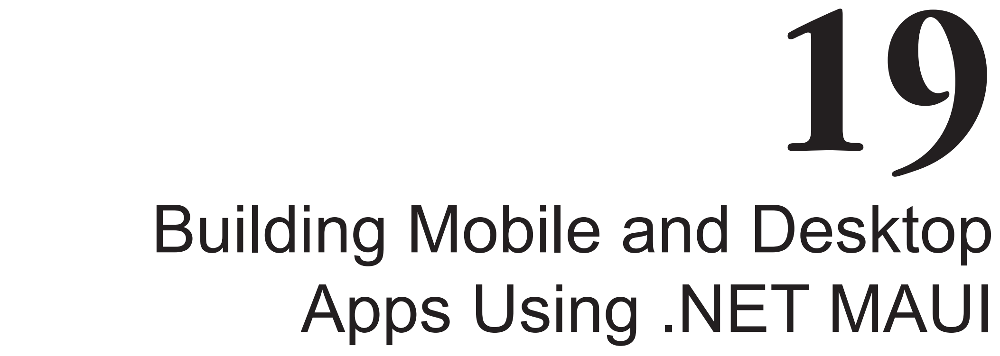

## November 8, 2021 - .NET MAUI Preview 10 released today. I hope to update this chapter for Preview 10 as soon as possible.

This chapter is about learning how to make graphical user interface (GUI) apps by building a cross-platform mobile and desktop app for iOS and Android, macOS Catalyst and Windows using .NET MAUI (Multi-platform App User Interface). 

You will also learn how to build hybrid web/native apps using .NET MAUI Blazor apps and the BlazorWebView component. 

You will see how eXtensible Application Markup Language (XAML) makes it easy to define the user interface for a graphical app. 

Cross-platform GUI development cannot be learned in a single chapter, but like web development, it is so important that I want to introduce you to some of what is possible. Think of this chapter as an introduction that will give you a taste to inspire you, and then you can learn more from a book dedicated to mobile or desktop development. 

The app will allow the listing and management of customers in the Northwind database. The mobile app that you create will call the Northwind service that you built using ASP.NET Core Web API in Chapter 17, Building and Consuming Web Services. If you have not built the Northwind service, please go back and build it now or download it from the GitHub repository for this book at the following link: https://github.com/markjprice/cs10dotnet6.

After .NET MAUI has its general availability release expected in May 2022, either a Windows computer with Visual Studio or a macOS computer with Visual Studio for Mac can be used to create a .NET MAUI project. But you will need a computer with Windows to compile WinUI 3 apps and you will need a computer with macOS and Xcode to compile for macOS Catalyst and iOS. Although you can create a .NET MAUI project at the command line and then edit it using Visual Studio Code, there is no official tooling to help you. That is expected to come with .NET 7.0 in later 2022. 

In this chapter, we will cover the following topics:
- [Understanding the .NET MAUI delay](#Understanding-the-NET-MAUI-delay)
- Understanding XAML
- Understanding .NET MAUI
- Building mobile and desktop apps using .NET MAUI
- Consuming a web service from a .NET MAUI app
- Hosting Blazor Server components in .NET MAUI

# Understanding the .NET MAUI delay
On September 14, 2021, Microsoft announced that .NET MAUI would be delayed. "Unfortunately, .NET MAUI will not be ready for production with .NET 6 GA in November." – Scott Hunter, Director Program Management, .NET

https://devblogs.microsoft.com/dotnet/update-on-dotnet-maui/

The following seems a likely timeline of preview and release candidate releases leading to the general availability release of .NET MAUI in about six months:

- October 12, 2021: .NET MAUI Preview 9 and .NET 6 Release Candidate 2 that were used for this chapter in the printed and ebook editions of this book. 
- November 9, 2021: .NET MAUI Preview 10 and .NET 6
- December 2021: .NET MAUI Preview 11
- January 2022: .NET MAUI Preview 12
- February 2022: .NET MAUI Preview 13
- March 2022: .NET MAUI Release Candidate 1
- April 2022: .NET MAUI Release Candidate 2
- May 2022: .NET MAUI General Availability at Microsoft Build
- November 2022: .NET MAUI included with .NET 7

My publisher, Packt, and I wanted to include this chapter in the print book even though parts are likely to change after publishing. To keep the chapter up to date as .NET MAUI previews continue to be released, I plan to update this chapter in the GitHub repository for this book up until the GA release. You can find the online version of this Chapter 20 at the following link:

https://github.com/markjprice/cs10dotnet6/tree/main/docs/chapter20

