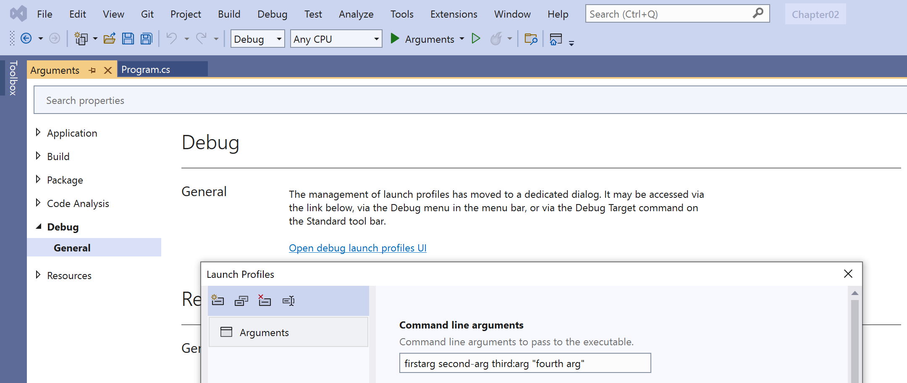
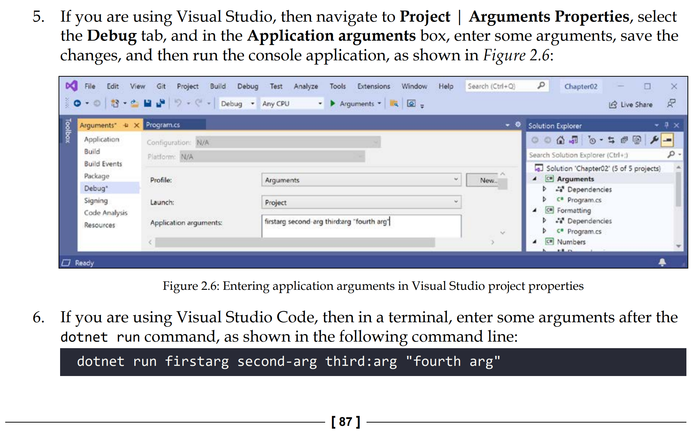

# Errata, Improvements and Troubleshooting

If you find any mistakes in the sixth edition, *C# 10 and .NET 6 - Modern Cross-Platform Development*, or if you have suggestions for improvements, then please [raise an issue in this repository](https://github.com/markjprice/cs10dotnet6/issues) or email me at markjprice (at) gmail.com.

## Page 8 - Installing other extensions

In the table of extensions, the identifier for **MSBuild project tools** should be `tintoy` not `tinytoy`.

## Page 18 - Writing code using Visual Studio 2022

In Step 3, the project template name has been changed from **Console Application** to **Console App** in the final release of Visual Studio 2022, as shown in the following screenshot:


## Page 25 - Writing code using Visual Studio Code

In Step 14, I say that the first time you open a code file, Visual Studio Code may have to download and install C# dependencies and so on. This will not happen if you do not trust the workspace. 

At the top of the window, in the blue bar, click **Manage**, as shown in the following screenshot:


Click the **Trust** button, as shown in the following screenshot:


You will then trust the workspace and extensions will activate as described in the book. 


## Page 82 - Formatting using interpolated strings

In the last code block in this section, the string is missing the `$` prefix that makes it interpolated, as shown in the following code:
```
private const string fullname = "{firstname} {lastname}";
```
The code should be as follows:
```
private const string fullname = $"{firstname} {lastname}";
```

## Page 87 - Passing arguments to a console app

In Step 5, I say, "If you are using Visual Studio, then navigate to **Project** | **Arguments Properties**, select the **Debug** tab, and in the **Application arguments** box, enter some arguments". 

Microsoft changed the user interface of Visual Studio 2022 after that step was written. 

It should now say, "If you are using Visual Studio, then navigate to **Project** | **Arguments Properties**, select 
the **Debug** tab, click **Open debug launch profiles UI**, and in the **Command line arguments** box, enter some arguments", as shown in the following screenshot:



In *Figure 2.6*, it is difficult to see the hyphen in the second argument in the PDF edition (shown in the screenshot below) and impossible to see it in the Kindle edition. 

In Step 5, it would have been clearer if I had written out the arguments as I did in Step 6 instead of relying on Amazon's image processing to clearly show the hyphen! 

For example, `firstarg second-arg third:arg "fourth arg"`. 



## Page 92 - Exercise 2.3 – Practice number sizes and ranges

In Exercise 2.3, I say, "create a console application project named Exercise02". I should have said, "create a console application project named Exercise03".

## Page 140 - Documenting functions with XML comments

First, it is worth emphasizing that this feature is primarily designed to be used with a tool that converts the comments into documentation. The tooltips that appear while entering code or hovering over the function name are a secondary feature. Understanding this will help you understand the limitation involved with this errata item.

Second, in Step 4, I say that when calling the function you will see more details. However, when the .NET 6 project templates changed in Preview 7 to use top-level statements and an automatically generated `Program` class, the functions you write in the tasks became implemented as local functions declared inside the hidden automatically generated `$<Main>` method. Local functions do not support XML comments because local functions cannot be used outside the member in which they are declared so it makes no sense to generate documentation from them. Sadly, this also means no tooltip, which would still be useful, but neither Visual Studio 2022 nor Visual Studio Code recognize that.

To enable XML comments for the `CardinalToOrdinal` function, we must therefore define it inside a class. The easiest way to do this is to add the function to the automatically generated partial `Program` class by moving the function to the bottom of the `Program.cs` file and wrapping it in a partial `Program` class, as shown in the following code:

```
// This must be at the bottom of the Program.cs file to avoid compile errors.
// Or you could create a separate file, perhaps named Program.CardinalToOrdinal.cs
partial class Program
{
    /// <summary>
    /// Pass a 32-bit integer and it will be converted into its ordinal equivalent.
    /// </summary>
    /// <param name="number">Number is a cardinal value e.g. 1, 2, 3, and so on.</param>
    /// <returns>Number as an ordinal value e.g. 1st, 2nd, 3rd, and so on.</returns>
    static string CardinalToOrdinal(int number)
    {
        switch (number)
        {
            case 11: // special cases for 11th to 13th
            case 12:
            case 13:
                return $"{number}th";
            default:
                int lastDigit = number % 10;
                string suffix = lastDigit switch
                {
                    1 => "st",
                    2 => "nd",
                    3 => "rd",
                    _ => "th"
                };
                return $"{number}{suffix}";
        }
    }
}
```

## Page 168 - Understanding the call stack

In Step 8, on page 170, I say to run the console app. Unless you need to step through your code to debug it, you should always run your code without the debugger attached. In this case it is especially important not to attach the debugger because if you do, then it will catch the exception and show it in a GUI dialog box instead of outputting it as shown in the book. 

## Page 183 - Importing a namespace to use a type

In Step 3, I wrote a comment with the older C# syntax and a statement with the newer syntax for instantiating a new object, as shown in the following code:
```
// var bob = new Person(); // C# 1.0 or later
Person bob = new(); // C# 9.0 or later
```
The `var` keyword was not introduced until C# 3.0, so I should have written the following:
```
// Person bob = new Person(); // C# 1.0 or later
// var bob = new Person(); // C# 3.0 or later
Person bob = new(); // C# 9.0 or later
```
## Page 192 - Making a field constant

In Step 1, the string literal should be `"Homo Sapiens"`. In Step 3, the output should be `"Homo Sapiens"`.

<!---
## Conflicting build servers for Omnisharp with Visual Studio Code

If you have Visual Studio for Windows and Visual Studio Code and the C# extension installed on the same computer, the build process can sometimes conflict. This is because Visual Studio has its own non-standard build server that is different from the standard build server used by .NET SDK and Omnisharp.

You can determine if you have this issue by reviewing the Omnisharp logs. 

For example, as shown in the following output:
```
TODO
```

You can control where Omnisharp looks for the build server by creating a configuration file. 

1. In the installation folder for Omnisharp: xxx
2. Create a file named omnisharp.json.
3. Contents of the file:
```
TODO
```
Read more about this issue: https://github.com/OmniSharp/omnisharp-roslyn/wiki/Configuration-Options
--->
