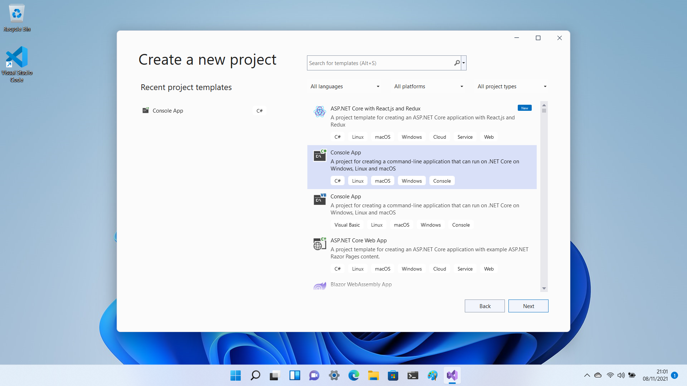

# Errata, Improvements and Troubleshooting

If you find any mistakes in the sixth edition, *C# 10 and .NET 6 - Modern Cross-Platform Development*, or if you have suggestions for improvements, then please [raise an issue in this repository](https://github.com/markjprice/cs10dotnet6/issues) or email me at markjprice (at) gmail.com.


## Page 18 - Writing code using Visual Studio 2022

In Step 3, the project template name has been changed from **Console Application** to **Console App** in the final release of Visual Studio 2022, as shown in the following screenshot:



## Page 25 - Writing code using Visual Studio Code

In Step 14, I say that the first time you open a code file, Visual Studio Code may have to download and install C# dependencies and so on. This will not happen if you do not trust the workspace. 

At the top of the window, in the blue bar, click **Manage**, as shown in the following screenshot:


Click the **Trust** button, as shown in the following screenshot:


You will then trust the workspace and extensions will activate as described in the book. 


<!---
## Conflicting build servers for Omnisharp with Visual Studio Code

If you have Visual Studio for Windows and Visual Studio Code and the C# extension installed on the same computer, the build process can sometimes conflict. This is because Visual Studio has its own non-standard build server that is different from the standard build server used by .NET SDK and Omnisharp.

You can determine if you have this issue by reviewing the Omnisharp logs. 

For example, as shown in the following output:
```
TODO
```

You can control where Omnisharp looks for the build server by creating a configuration file. 

1. In the installation folder for Omnisharp: xxx
2. Create a file named omnisharp.json.
3. Contents of the file:
```
TODO
```
Read more about this issue: https://github.com/OmniSharp/omnisharp-roslyn/wiki/Configuration-Options
--->
